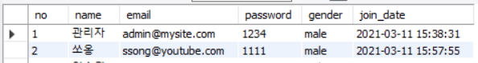
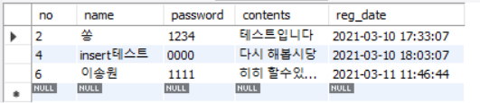
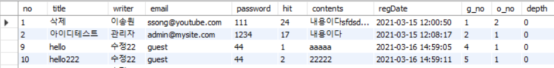

# Mysite02

## 테이블 구성

- user




- guestbook




- board




## User

```mysql
-- 회원
DROP TABLE IF EXISTS `user` RESTRICT;

-- 회원
CREATE TABLE `user` (
	`no`        INT UNSIGNED          NOT NULL COMMENT '번호', -- 번호
	`name`      VARCHAR(50)           NOT NULL COMMENT '이름', -- 이름
	`email`     VARCHAR(200)          NOT NULL COMMENT '이메일', -- 이메일
	`password`  VARCHAR(20)           NOT NULL COMMENT '비밀번호', -- 비밀번호
	`gender`    ENUM('male','female') NOT NULL COMMENT '성별', -- 성별
	`join_date` DATETIME              NOT NULL COMMENT '가입' -- 가입
)
COMMENT '회원';

-- 회원
ALTER TABLE `user`
	ADD CONSTRAINT `PK_user` -- 회원 기본키
		PRIMARY KEY (
			`no` -- 번호
		);

ALTER TABLE `user`
	MODIFY COLUMN `no` INT UNSIGNED NOT NULL AUTO_INCREMENT COMMENT '번호';
```


## GuestBook

```mysql
-- 방명록
DROP TABLE IF EXISTS `guestbook` RESTRICT;

-- 방명록
CREATE TABLE `guestbook` (
	`no`       INT UNSIGNED NOT NULL COMMENT '번호', -- 번호
	`name`     VARCHAR(50)  NOT NULL COMMENT '이름', -- 이름
	`password` VARCHAR(20)  NOT NULL COMMENT '비밀번호', -- 비밀번호
	`contents` TEXT         NOT NULL COMMENT '내용', -- 내용
	`reg_date` DATETIME     NOT NULL COMMENT '등록일' -- 등록일
)
COMMENT '방명록';

-- 방명록
ALTER TABLE `guestbook`
	ADD CONSTRAINT `PK_guestbook` -- 방명록 기본키
		PRIMARY KEY (
			`no` -- 번호
		);

ALTER TABLE `guestbook`
	MODIFY COLUMN `no` INT UNSIGNED NOT NULL AUTO_INCREMENT COMMENT '번호';
```


## Board


```mysql
-- 게시판
DROP TABLE IF EXISTS `board` RESTRICT;

-- 게시판
CREATE TABLE `board` (
	`no`       INT UNSIGNED NOT NULL COMMENT '번호', -- 번호
	`title`    VARCHAR(200) NOT NULL COMMENT '타이틀', -- 타이틀
	`writer`   VARCHAR(50)  NOT NULL COMMENT '글쓴이', -- 글쓴이
	`email`    VARCHAR(200) NOT NULL COMMENT '이메일', -- 이메일
	`password` VARCHAR(20)  NOT NULL COMMENT '비밀번호', -- 비밀번호
	`hit`      VARCHAR(50)  NOT NULL DEFAULT 0 COMMENT '조회수', -- 조회수
	`contents` TEXT         NOT NULL COMMENT '내용', -- 내용
	`regDate`  DATETIME     NOT NULL COMMENT '작성일', -- 작성일
	`g_no`     VARCHAR(50)  NOT NULL DEFAULT 0 COMMENT '그룹번호', -- 그룹번호
	`o_no`     VARCHAR(50)  NOT NULL COMMENT '그룹내 순서', -- 그룹내 순서
	`depth`    VARCHAR(50)  NOT NULL COMMENT '글의 깊이', -- 글의 깊이
	`flag`     INT UNSIGNED NOT NULL DEFAULT 0 COMMENT '삭제여부' -- 삭제여부
)
COMMENT '게시판';

-- 게시판
ALTER TABLE `board`
	ADD CONSTRAINT `PK_board` -- 게시판 기본키
		PRIMARY KEY (
			`no` -- 번호
		);

ALTER TABLE `board`
	MODIFY COLUMN `no` INT UNSIGNED NOT NULL AUTO_INCREMENT COMMENT '번호';
```


### insert

```mysql
insert into board values(null,'qwer','이송원','ssong@youtube.com','111',0,'qqqqqqqqqqqqqq',now(),(select max(cast(g_no as unsigned))+1 from board as b),1,0);
```

